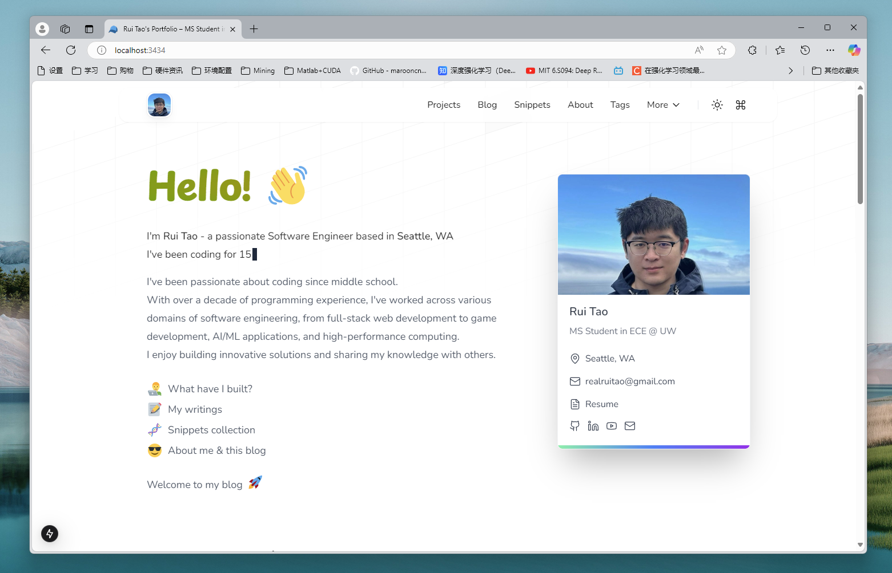

<h1 align="center">ruit.me 🧑‍💻</h1>

## Motivation

> Learning by sharing, growing by doing!

This is my personal blog where I document my journey as a software engineer. I share my learnings, experiences, and insights about software development.

Writing helps me organize my thoughts and deepen my understanding of technical concepts. Through this blog, I aim to contribute to the developer community and hopefully help others who are on a similar path.

Feel free to leave comments or reach out if you find anything interesting or have questions! 🍻

## Tech Stack

This blog is built with modern web technologies:

- 🚀 [Next.js](https://nextjs.org/) 14+ (App Router) for the framework
- 💨 [Tailwind CSS](https://tailwindcss.com/) for styling
- ⚡ [Vercel](https://vercel.com/) for hosting

Based on the excellent [Tailwind Nextjs Starter Blog](https://github.com/timlrx/tailwind-nextjs-starter-blog) by Timothy Lin, with several enhancements:

- ⚛️ Upgraded to **React 18+** and **NextJS 14+** with App Router
- 🎯 Full **TypeScript** support with strict type checking
- 📊 Analytics integration with [Umami](https://umami.is/)
- 🌙 Dark mode using [Github dark dimmed](https://github.blog/changelog/2021-04-14-dark-and-dimmed-themes-are-now-generally-available/) theme
- 🎨 Customized UI components including ProfileCard, CareerTimeline
- 📚 Additional features like /snippets

## Assets

Images: [Unsplash](https://unsplash.com/)  
GIFs: [GIPHY](https://giphy.com/)  
Illustrations: [Storyset](https://storyset.com/)

## Star History

<a href="https://star-history.com/#skymore/ruit.me&Date">
 <picture>
   <source media="(prefers-color-scheme: dark)" srcset="https://api.star-history.com/svg?repos=skymore/ruit.me&type=Date&theme=dark" />
   <source media="(prefers-color-scheme: light)" srcset="https://api.star-history.com/svg?repos=skymore/ruit.me&type=Date" />
   
 </picture>
</a>

---

Copyright (c) 2025 - Rui's blog
