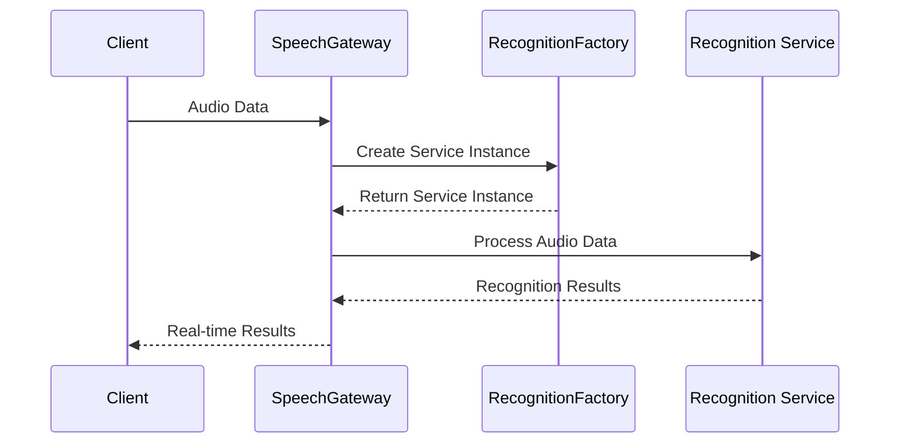
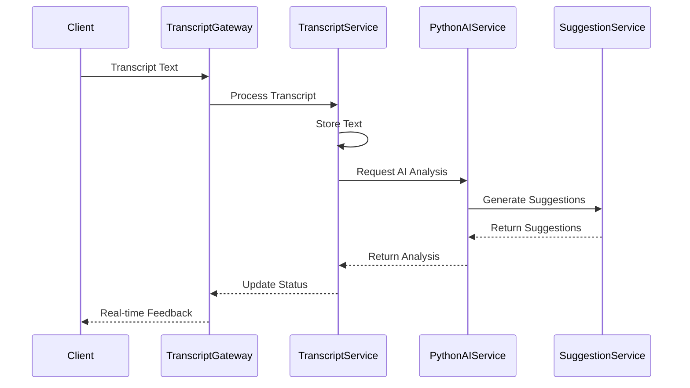
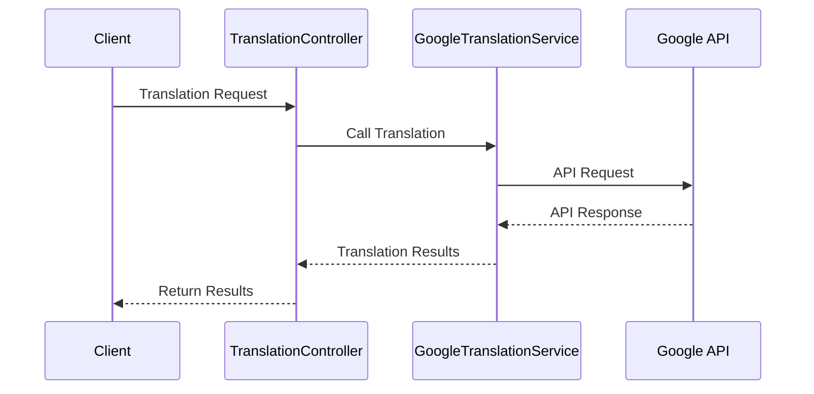

Building a modern backend system requires careful consideration of modularity, scalability, and maintainability. This article explores the architecture and implementation of a modular backend system using NestJS and TypeScript, with a focus on real-time communication and service integration.

## System Architecture Overview

The system is built around three core modules:

1. **Speech Module**: Handles real-time speech recognition
2. **Transcript Module**: Manages transcription and AI analysis
3. **Translation Module**: Provides translation services

Each module is designed to be independent yet interconnected through well-defined interfaces.

## Core Modules Deep Dive

### Speech Module

The Speech Module handles all speech recognition related functionality:

```typescript
@Module({
    providers: [
        SpeechGateway,
        RecognitionFactory,
        GoogleRecognitionService,
        BaiduRecognitionService,
    ],
    exports: [SpeechGateway],
})
export class SpeechModule {}
```

Key components include:
- SpeechGateway: WebSocket gateway for real-time communication
- RecognitionFactory: Factory for creating recognition service instances
- Recognition Services: Implementations for different providers

### Transcript Module

The Transcript Module manages transcription and AI analysis:

```typescript
@Module({
    providers: [
        TranscriptGateway,
        TranscriptService,
        ConnectionManagerService,
        PythonAIService,
        SuggestionService,
    ]
})
export class TranscriptModule {}
```

Key components include:
- TranscriptGateway: Handles real-time transcription WebSocket connections
- TranscriptService: Manages transcription text
- PythonAIService: Handles AI analysis
- SuggestionService: Generates suggestions

### Translation Module

The Translation Module provides translation services:

```typescript
@Module({
    controllers: [TranslationController],
    providers: [GoogleTranslationService],
})
export class TranslationModule {}
```

Key components include:
- TranslationController: REST API endpoints
- GoogleTranslationService: Translation implementation

## Core Service Interfaces

### Recognition Service Interface

```typescript
interface IRecognitionService extends OnModuleInit {
    startRecognition(config: IRecognitionConfig): Promise<void>;
    stopRecognition(): void;
    onRecognitionResult(callback: (result: RecognitionResult) => void): void;
    onError(callback: (error: Error) => void): void;
    processAudioData(data: Buffer): Promise<void>;
}
```

### Translation Service Interface

```typescript
interface ITranslationService {
    translate(text: string, targetLanguage: string, sourceLanguage?: string): Promise<TranslationResult>;
    detectLanguage(text: string): Promise<string>;
}
```

### AI Service Interface

```typescript
interface IAIService {
    sendMessage(message: AIRequest): void;
    addMessageHandler(handler: (response: AIResponse) => void): void;
    removeMessageHandler(handler: (response: AIResponse) => void): void;
}
```

## Data Flow Patterns

### Speech Recognition Flow



### Transcription Flow



### Translation Flow



## Key Implementation Details

### Session Management

The system implements robust session management:

1. **Connection Management**
   - WebSocket connection tracking
   - Multi-device session support
   - State synchronization

2. **Audio Stream Processing**
   - Buffer-based audio data handling
   - Automatic reconnection
   - Multiple format support

3. **Real-time Transcription**
   - Segmented text processing
   - Incremental updates
   - Multi-role support

### Error Handling

The system implements comprehensive error handling:

1. **Error Types**
   - Connection drops
   - Service timeouts
   - API rate limits
   - Format errors

2. **Recovery Strategies**
   - Automatic reconnection
   - Service degradation
   - Error notifications
   - Session recovery

## Performance Optimization

Several strategies are employed to optimize performance:

### Resource Management
1. **Service Instance Cleanup**
   - Timely cleanup of unused instances
   - Concurrent connection control
   - Memory usage monitoring

2. **Caching Strategy**
   - Audio data buffering
   - Transcript text caching
   - Suggestion result caching

### Data Processing
1. **Stream Processing**
   - Chunked data handling
   - Incremental updates
   - Batch processing when appropriate

2. **Memory Management**
   - Buffer pooling
   - Resource limits
   - Garbage collection optimization

## Monitoring and Logging

The system implements comprehensive monitoring:

### Key Metrics
1. **Performance Metrics**
   - Recognition accuracy
   - Response latency
   - Error rates
   - Concurrent connections
   - Resource utilization

2. **Logging Levels**
   - DEBUG: Detailed debugging
   - INFO: Regular operations
   - WARN: Potential issues
   - ERROR: Error conditions

## Security Considerations

Security is implemented at multiple levels:

### Data Security
1. **Connection Security**
   - WebSocket authentication
   - API access control
   - Sensitive data encryption

2. **Service Protection**
   - Rate limiting
   - Concurrency control
   - Request filtering

## Extensibility

The system is designed for easy extension:

### Adding New Services
1. **Recognition Services**
   - Implement service interface
   - Register in factory
   - Update configuration

2. **AI Models**
   - Add model support
   - Configure parameters
   - Extend prompt types

## Best Practices

Key practices to follow:

1. **Development Standards**
   - Use dependency injection
   - Follow SOLID principles
   - Implement proper error handling
   - Write comprehensive tests

2. **Deployment Guidelines**
   - Use environment configuration
   - Implement health checks
   - Set up monitoring
   - Plan for scaling

## Conclusion

Building a modular backend system with NestJS requires careful consideration of architecture, performance, and maintainability. By following the patterns and practices outlined in this article, you can create a robust system that is both scalable and maintainable.

Key takeaways:

1. Use modular architecture for better organization
2. Implement proper interfaces for service integration
3. Handle errors comprehensively
4. Monitor system performance
5. Plan for security and extensibility

Remember that a successful backend system requires not just good initial architecture, but also ongoing maintenance and optimization.

## References

- [NestJS Documentation](https://docs.nestjs.com/)
- [WebSocket Documentation](https://developer.mozilla.org/en-US/docs/Web/API/WebSocket)
- [TypeScript Documentation](https://www.typescriptlang.org/docs/)
- [Google Cloud Services](https://cloud.google.com/docs) 