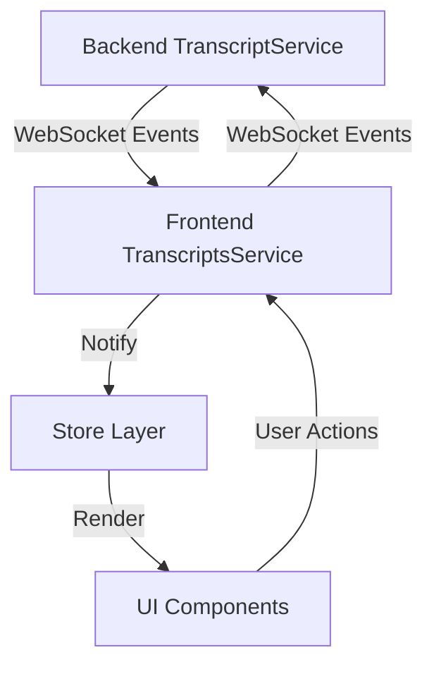

## Introduction

Building a real-time transcript system requires careful consideration of architecture, state management, and performance optimization. In this article, we'll explore how to design and implement a robust transcript system that can handle real-time updates efficiently.

## System Architecture

The transcript system follows a distributed architecture with a source-of-truth pattern:



### Backend Design

The backend serves as the source of truth for all transcript data. It maintains:

1. **User-specific State Maps**
   - Last spoke time tracking
   - Current text buffers
   - Translation states
   - Transcript history

2. **Core Components**
```typescript
class TranscriptService {
       /** Maximum time gap (ms) between speech segments */
       private readonly MAX_GAP = 3000;

       /** User-specific state maps */
       private readonly lastSpokeTime: Map<userId, { 
           interviewer: number; 
           candidate: number 
       }>;
       private readonly currentText: Map<userId, { 
           interviewer: string; 
           candidate: string 
       }>;
       private readonly transcripts: Map<userId, Map<transcriptId, TranscriptType>>;
}
```

### Frontend Architecture

The frontend maintains a synchronized local cache and handles:

1. **State Management**
```typescript
   class TranscriptsService {
       /** Local cache of transcripts */
       private transcripts: TranscriptType[];

       /** Feature configuration */
       private isAIEnabled: boolean;
       private isTranslateEnabled: boolean;
       private targetLanguage: 'en' | 'zh';
}
```

2. **Message Types**
```typescript
   interface TranscriptMessage {
       type: 'transcript';
       transcript: TranscriptType;
       aiEnabled: boolean;
       role: Role;
       sessionId: string;
}
```

## Real-time Communication

### WebSocket Events
    
1. **Backend to Frontend**
   - `transcript_update`: New or updated transcript
   - `sync_transcripts`: Initial state sync
   - `clear_transcripts`: Reset notification

2. **Frontend to Backend**
   - Configuration updates
   - User actions
   - State synchronization requests

### Data Flow

1. **Initial Load**
```typescript
   class TranscriptsService {
       private setupSocketListeners() {
           this.socket.on('sync_transcripts', (data) => {
               this.transcripts = data;
               this.notifyStores();
           });
    }
}
```

2. **Real-time Updates**
```typescript
   @SubscribeMessage('transcript')
   async handleTranscript(message: TranscriptMessage) {
       // Update source of truth
       const updated = await this.transcriptService.update(message);
       // Broadcast to all clients
       this.broadcast(updated);
}
```

## Error Handling

### Connection Management

1. **Automatic Reconnection**
```typescript
   class TranscriptsService {
       private setupReconnection() {
           this.socket.on('disconnect', () => {
               this.reconnectAttempts = 0;
               this.scheduleReconnect();
        });
    }

       private scheduleReconnect() {
           if (this.reconnectAttempts >= MAX_RECONNECT_ATTEMPTS) {
               this.notifyError('Connection failed');
               return;
           }
           setTimeout(() => this.connect(), this.getBackoffDelay());
       }
}
```

2. **State Recovery**
```typescript
   class TranscriptService {
       async recoverState(userId: string) {
           const transcripts = this.transcripts.get(userId);
           return Array.from(transcripts.values());
    }
}
```