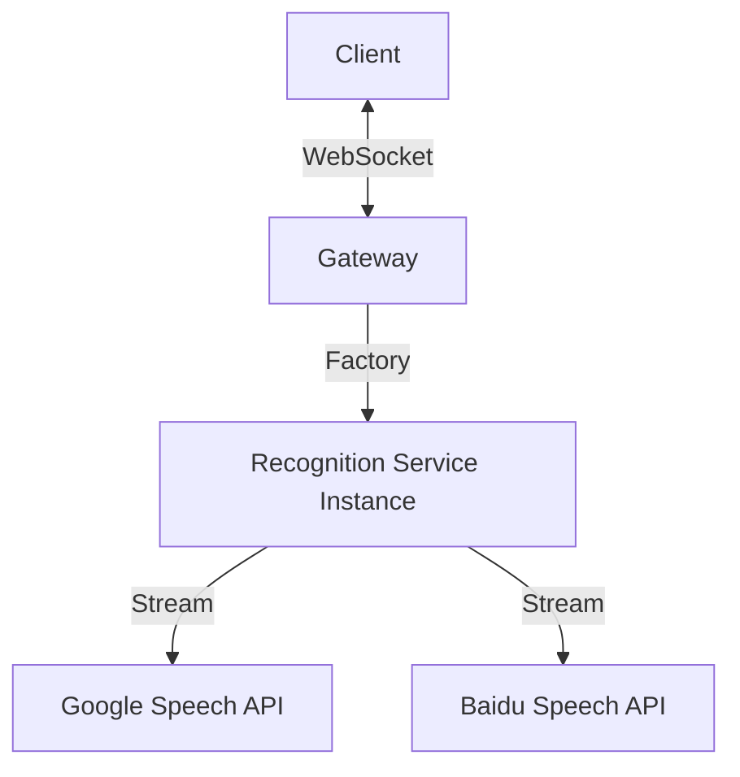
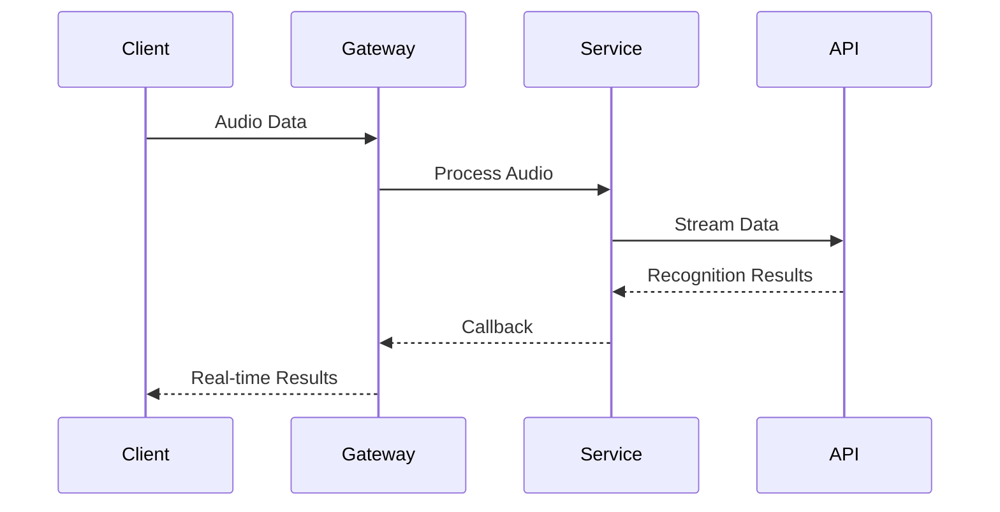

In modern web applications, real-time speech recognition has become increasingly important for enhancing user interactions. This article explores the architecture and implementation of a scalable real-time speech recognition system that can handle multiple concurrent users and different speech recognition providers.

## System Architecture Overview

The system is built around three core components:

1. **Speech Gateway**: Manages WebSocket connections and audio streams
2. **Recognition Factory**: Creates and manages recognition service instances
3. **Recognition Services**: Handles the actual speech recognition using different providers

Here's a high-level overview of how these components interact:



## Core Components Deep Dive

### Speech Gateway

The Speech Gateway is the entry point for all client connections. It handles:

- WebSocket connection lifecycle
- Audio data streaming
- Client session management
- Real-time result forwarding

Key features include:

```typescript
@WebSocketGateway({
  cors: {
    origin: '*',
    credentials: true
  }
})
export class SpeechGateway implements OnGatewayConnection, OnGatewayDisconnect {
  @WebSocketServer()
  server: Server;

  private sessions: Map<string, IRecognitionService> = new Map();

  constructor(private recognitionFactory: RecognitionFactory) {}

  async handleConnection(client: Socket) {
    // Create a new recognition service instance for each client
    const service = this.recognitionFactory.createService();
    this.sessions.set(client.id, service);
    
    // Set up result handling
    service.onRecognitionResult((result) => {
      client.emit('recognition_result', result);
    });
  }

  async handleDisconnect(client: Socket) {
    // Clean up resources when client disconnects
    const service = this.sessions.get(client.id);
    if (service) {
      service.stopRecognition();
      this.sessions.delete(client.id);
    }
  }

  @SubscribeMessage('audio_data')
  async handleAudioData(client: Socket, data: Buffer) {
    const service = this.sessions.get(client.id);
    if (service) {
      await service.processAudioData(data);
    }
  }
}
```

### Recognition Factory

The Recognition Factory creates and configures recognition service instances:

```typescript
@Injectable()
export class RecognitionFactory {
  createService(type: 'google' | 'baidu' = 'google'): IRecognitionService {
    switch (type) {
      case 'google':
        return new GoogleSpeechService(this.config.google);
      case 'baidu':
        return new BaiduSpeechService(this.config.baidu);
      default:
        throw new Error(`Unsupported recognition service: ${type}`);
    }
  }
}
```

### Recognition Service Interface

All recognition services implement a common interface:

```typescript
interface IRecognitionService extends OnModuleInit {
    startRecognition(config: IRecognitionConfig): Promise<void>;
    stopRecognition(): void;
    onRecognitionResult(callback: (result: RecognitionResult) => void): void;
    onError(callback: (error: Error) => void): void;
    processAudioData(data: Buffer): Promise<void>;
}
```

## Data Flow and Session Lifecycle

The system follows a clear data flow pattern:



### Session Lifecycle Management

1. **Connection Establishment**
   - Client connects via WebSocket
   - System creates a dedicated recognition service
   - Service is configured and initialized

2. **Data Processing**
   - Client streams audio data
   - Gateway forwards to recognition service
   - Results are streamed back in real-time

3. **Connection Termination**
   - Service instance is cleaned up
   - Resources are released
   - Recognition streams are closed

## Error Handling and Recovery

The system implements robust error handling:

```typescript
class RecognitionService implements IRecognitionService {
  private retryCount = 0;
  private readonly MAX_RETRIES = 3;

  private async handleError(error: Error) {
    if (this.retryCount < this.MAX_RETRIES) {
      this.retryCount++;
      await this.reconnect();
    } else {
      this.errorCallback(error);
    }
  }

  private async reconnect() {
    try {
      await this.stopRecognition();
      await this.startRecognition(this.config);
      this.retryCount = 0;
    } catch (error) {
      this.handleError(error);
    }
  }
}
```

## Performance Optimization

Several strategies are employed to optimize performance:

1. **Resource Management**
   - Efficient cleanup of unused services
   - Controlled concurrent connections
   - Memory usage monitoring

2. **Data Optimization**
   - Audio data buffering
   - Stream reconstruction
   - Load balancing

## Monitoring and Metrics

Key metrics are tracked for system health:

1. **Performance Metrics**
   - Recognition accuracy
   - Response latency
   - Error rates
   - Concurrent connections
   - Resource utilization

2. **Logging**
   - Operation logs
   - Error logs
   - Performance metrics
   - Audit logs

## Best Practices and Development Guidelines

1. **Development Standards**
   - Use factory pattern for service creation
   - Follow dependency injection principles
   - Maintain stateless services
   - Handle asynchronous operations correctly

2. **Testing Strategy**
   - Unit tests for core logic
   - Integration tests for workflows
   - Performance tests for concurrency
   - Error scenario simulations

## Extensibility

The system is designed for easy extension:

1. **Adding New Recognition Services**
   - Implement IRecognitionService interface
   - Add support in factory
   - Configure service parameters
   - Update documentation

2. **Feature Extensions**
   - Support for additional languages
   - New recognition modes
   - Quality improvements
   - Enhanced error handling

## Conclusion

Building a scalable real-time speech recognition system requires careful consideration of architecture, performance, and error handling. By following the patterns and practices outlined in this article, you can create a robust system that can handle multiple users and different recognition providers while maintaining high performance and reliability.

The key takeaways are:

1. Use WebSocket for real-time communication
2. Implement proper resource management
3. Handle errors gracefully with retry mechanisms
4. Monitor system performance
5. Design for extensibility

Remember that the success of such a system depends not only on the initial implementation but also on continuous monitoring, optimization, and maintenance.

## References

- [WebSocket Documentation](https://developer.mozilla.org/en-US/docs/Web/API/WebSocket)
- [Google Cloud Speech-to-Text](https://cloud.google.com/speech-to-text)
- [Baidu Speech Recognition API](https://ai.baidu.com/tech/speech)
- [NestJS WebSocket Documentation](https://docs.nestjs.com/websockets/gateways) 