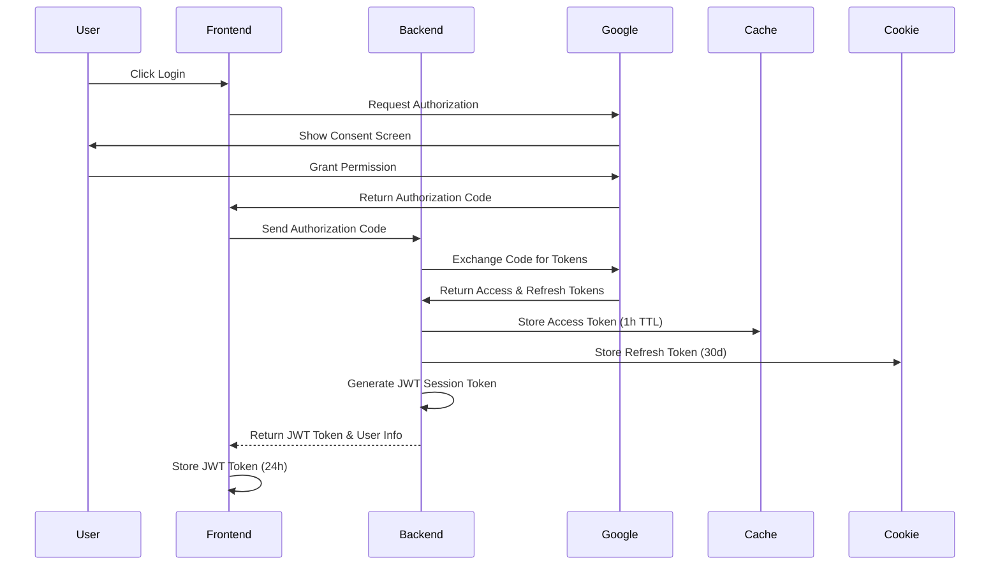
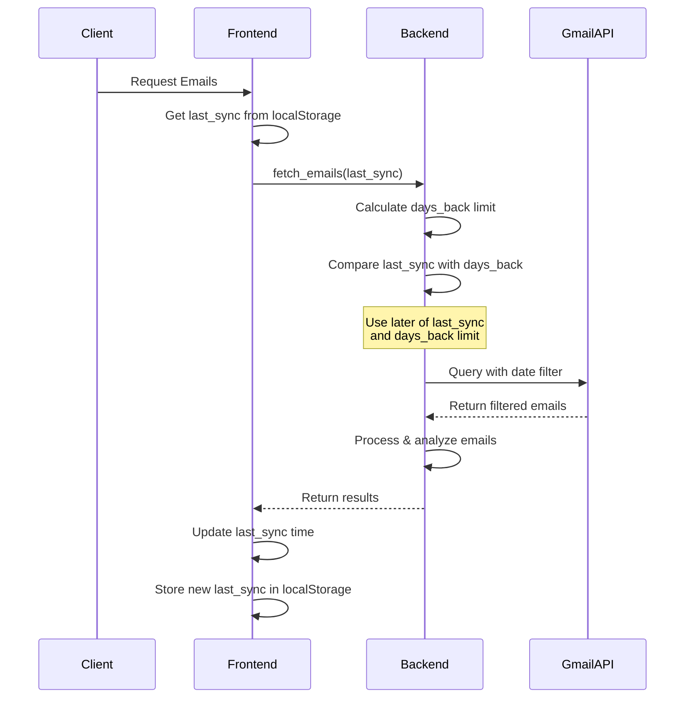

Building a secure and efficient email analysis system requires careful consideration of authentication, data processing, and performance optimization. This article explores the implementation of an email analysis feature using Google OAuth for authentication and GPT4O MINI for content analysis, with a focus on system architecture and best practices.

# Email Analysis with Google OAuth Integration

## Overview

This document outlines the implementation of the email analysis feature using Google OAuth for authentication and GPT4O MINI for email content analysis. The system allows users to analyze their job-related emails by connecting their Gmail account, processing the emails, and presenting the results in a structured format.


### Key Components

1. **Frontend Layer**

   - EmailAnalysis Page: React-based UI for email analysis
   - Google OAuth Integration: Handles user authentication flow
   - Local Storage: Stores JWT session token
   - Material-UI Components: Modern and responsive design

2. **Backend Services**

   - **Token Service**

     - Manages Gmail OAuth tokens
     - Generates and validates JWT session tokens
     - Handles token refresh and expiration
     - Implements token caching strategy

   - **Email Service**

     - Fetches emails using Gmail API
     - Implements batched email retrieval
     - Handles rate limiting and quotas
     - Manages email metadata caching

   - **Processing Service**
     - Analyzes email content
     - Classifies job application status
     - Extracts relevant information
     - Implements result caching

3. **Caching Layer**

   - **Token Cache**
     - TTLCache for Gmail access tokens (1 hour TTL)
     - No MongoDB storage for tokens
   - **Analysis Cache**
     - Memory Cache: Fast access to recent results (7 days TTL)
     - MongoDB Cache: Long-term storage (360 days TTL)

4. **Security Layer**
   - JWT-based session management
   - Secure token storage and transmission
   - Rate limiting and request validation
   - Error handling and logging

## Components

### Frontend Components

1. **EmailAnalysis Page**

   - Path: `src/pages/EmailAnalysis/`
   - Handles user interaction and displays email analysis results
   - Manages Google OAuth flow initiation

2. **Header Integration**
   - Path: `src/components/Layout/Header.tsx`
   - Provides navigation access to email analysis feature
   - Uses `MailOutlined` icon for visual representation

### Backend Services

1. **Token Service** (`server-python/src/services/token_service.py`)

   - Manages OAuth token lifecycle
   - Handles token exchange and validation
   - Implements token caching for performance

2. **Email Service** (`server-python/src/services/email_service.py`)

   ```mermaid
   sequenceDiagram
       participant Client
       participant EmailService
       participant TokenService
       participant GmailAPI
       participant ProcessingService

       Client->>EmailService: fetch_job_related_emails()
       EmailService->>TokenService: get_valid_token()
       TokenService->>TokenService: validate & refresh if needed
       TokenService-->>EmailService: Gmail access token
       EmailService->>GmailAPI: fetch with access token
       GmailAPI-->>EmailService: raw emails
       EmailService->>ProcessingService: process emails
       ProcessingService-->>EmailService: analysis results
       EmailService-->>Client: structured results
   ```

3. **Email Processing Service** (`server-python/src/services/email_processing_service.py`)
   - Analyzes email content using AI models
   - Classifies job application status
   - Extracts relevant information (company, position, dates)
   - Implements caching for processed results
   - Uses TTLCache for performance optimization

### API Routes

1. **Auth Routes** (`server-python/src/routes/auth_routes.py`)

   - POST `/api/auth/google`: Handle OAuth callback and create session token
   - POST `/api/auth/refresh`: Refresh expired access token
   - GET `/api/auth/validate`: Validate JWT session token

2. **Email Routes** (`server-python/src/routes/email_routes.py`)
   - GET `/api/emails/fetch`: Fetch and analyze emails (requires valid JWT)

All API routes use the `/api` prefix for better organization and clarity.

### Token Management

1. **Token Types**

   ```typescript
   interface TokenInfo {
     access_token: string // Short-lived Gmail access token
     refresh_token: string // Long-lived Gmail refresh token
     expires_in: number // Token expiration time in seconds
     token_type: string // Always "Bearer"
     scope?: string // OAuth scopes
   }
   ```

2. **Token Storage**

   - Access Tokens: In-memory TTLCache only (1 hour TTL)
   - Refresh Tokens: HttpOnly cookie only (30 days expiry)
   - Session Tokens: Client-side localStorage (24 hours expiry)

3. **Token Refresh Flow**

   ```mermaid
   sequenceDiagram
       participant Client
       participant Backend
       participant Google

       Client->>Backend: Request with expired token
       Backend->>Backend: Detect token expiration
       Backend->>Client: Return 401 with X-Token-Expired header
       Client->>Backend: POST /api/auth/refresh
       Note over Backend: Get refresh token from cookie
       Backend->>Google: Request new access token
       Google->>Backend: Return new tokens
       Backend->>Backend: Store access token in TTLCache
       Backend->>Client: Return new session token
   ```

4. **Token Security**

   - Access Token: Never exposed to frontend
   - Refresh Token: HttpOnly cookie, HTTPS only
   - Session Token: JWT with user info, short-lived

5. **Token Cleanup**
   - Access Token: Auto-removed from TTLCache after 1 hour
   - Refresh Token: Auto-expired from cookie after 30 days
   - Session Token: Auto-expired after 24 hours

### Authentication Flow



### User Session Management

1. **Session Token (JWT)**

   ```typescript
   interface SessionToken {
     sub: string // User email
     name: string // User name
     picture: string // User avatar URL
     exp: number // Expiration timestamp
   }
   ```

2. **Session Storage**

   - Frontend:
     ```typescript
     // Local Storage Keys
     const LOCAL_STORAGE_SESSION_TOKEN_KEY = 'email_analysis_session_token'
     const LOCAL_STORAGE_USER_INFO_KEY = 'email_analysis_user_info'
     const LOCAL_STORAGE_LAST_SYNC_KEY = 'email_analysis_last_sync'
     ```

3. **Session Validation**

   - Every API request includes JWT token in Authorization header
   - Backend validates token and user existence
   - Automatic token refresh on expiration

4. **Session Cleanup**
   - Automatic logout on token expiration
   - Clear local storage on logout
   - Revoke refresh token cookie

## Configuration

### Environment Variables

Required environment variables for setup:

- `GMAIL_CLIENT_ID`: Google OAuth client ID
- `GMAIL_CLIENT_SECRET`: Google OAuth client secret
- `GMAIL_REDIRECT_URIS`: OAuth callback URL

### OAuth Scopes

The application requires the following Gmail API scopes:

- `https://www.googleapis.com/auth/gmail.readonly`
- `https://www.googleapis.com/auth/userinfo.email`

## Internationalization

The feature supports multiple languages including:

- English (en)
- Chinese (zh)
- Traditional Chinese (zh-tw)
- Japanese (ja)
- Spanish (es)
- Korean (ko)

## Security Considerations

1. **Token Storage**

   - Access tokens stored in memory only (TTLCache)
   - Refresh tokens stored in HttpOnly cookies
   - No persistent token storage in MongoDB
   - Automatic token refresh handling

2. **Authentication Flow**
   - Implements standard OAuth 2.0 flow
   - Uses secure token exchange
   - Implements token expiration handling

## Error Handling

The system implements comprehensive error handling for:

- OAuth authentication failures
- Email fetching errors
- Processing service errors
- Rate limiting and throttling

## Performance Optimization

1. **Caching Strategy**

   - Two-tier caching system for email analysis results:
     - TTLCache (in-memory): Fast access, 7 days TTL
     - MongoDB (persistent): Long-term storage, 360 days TTL
   - Optimized email fetching process:
     - First fetch only message IDs
     - Check cache status for each message ID
     - For cached messages:
       - Only fetch minimal metadata (subject, from, to, date)
       - Skip body content fetching and parsing
     - For uncached messages:
       - Fetch full message content
       - Perform analysis
       - Cache results
   - Token caching for reduced API calls
   - Batch processing for multiple emails
   - Smart sync time handling:
     - Stores last sync time in UTC format
     - Uses the later time between last_sync time and days_back limit
     - Prevents processing of already analyzed emails
     - Ensures no emails beyond days_back limit are processed

2. **Rate Limiting**
   - Implements Gmail API rate limit handling
   - Batch processing to optimize API usage
   - Minimizes API calls through efficient caching

### Cache Settings

```python
# Memory Cache (TTLCache)
MAX_TOKEN_CACHE_SIZE = 1000      # Maximum tokens to cache
TOKEN_CACHE_TTL = 3600          # 1 hour in seconds

MAX_ANALYSIS_CACHE_SIZE = 1000   # Maximum analysis results to cache
ANALYSIS_CACHE_TTL = 604800     # 7 days in seconds

# MongoDB Cache
db_cache_ttl_days: int = 360    # 360 days for analysis results

# Local Storage Keys
LOCAL_STORAGE_LAST_SYNC_KEY = 'email_analysis_last_sync'  # Stores UTC timestamp
```

### Email Fetching Process with Sync Time


