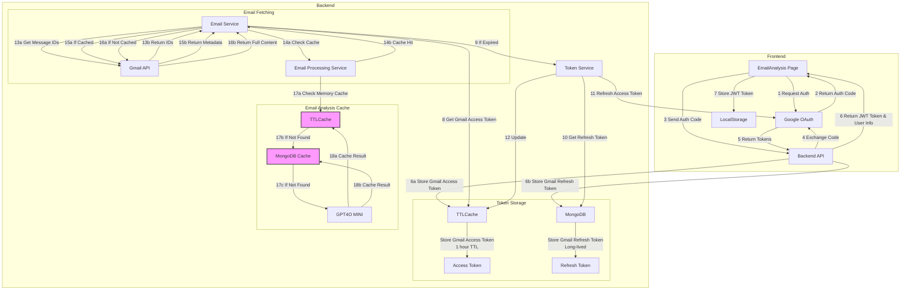
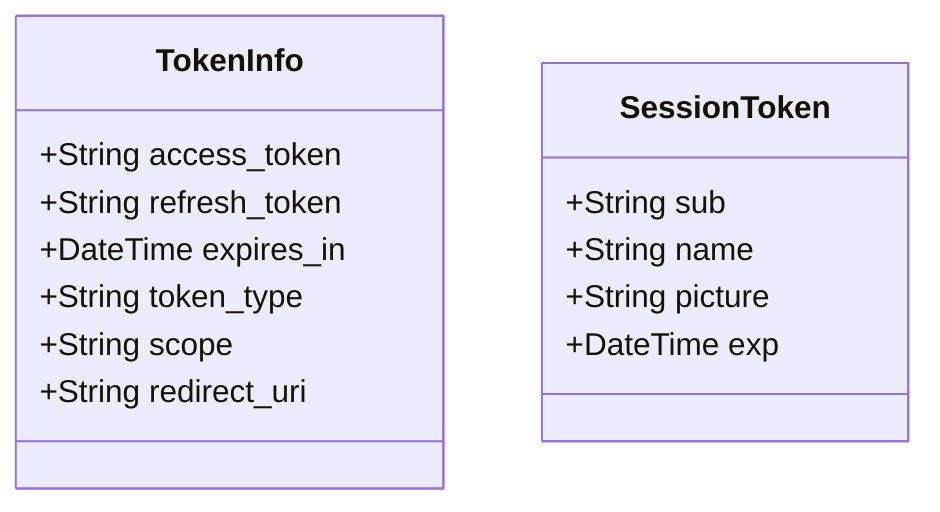
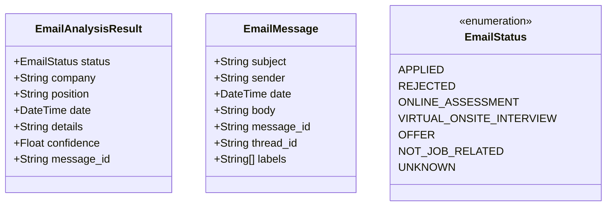
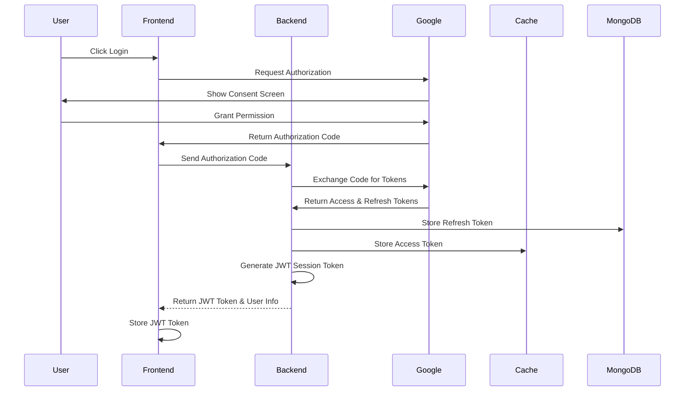
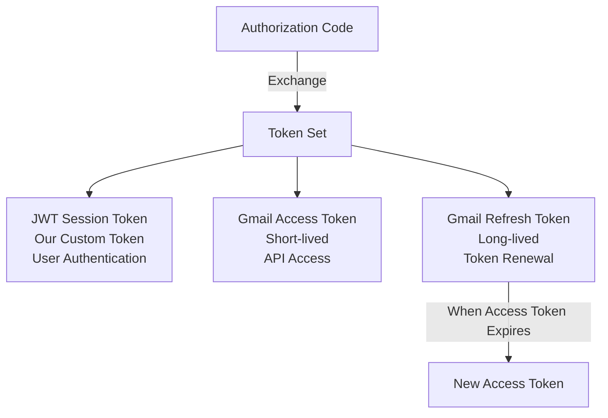
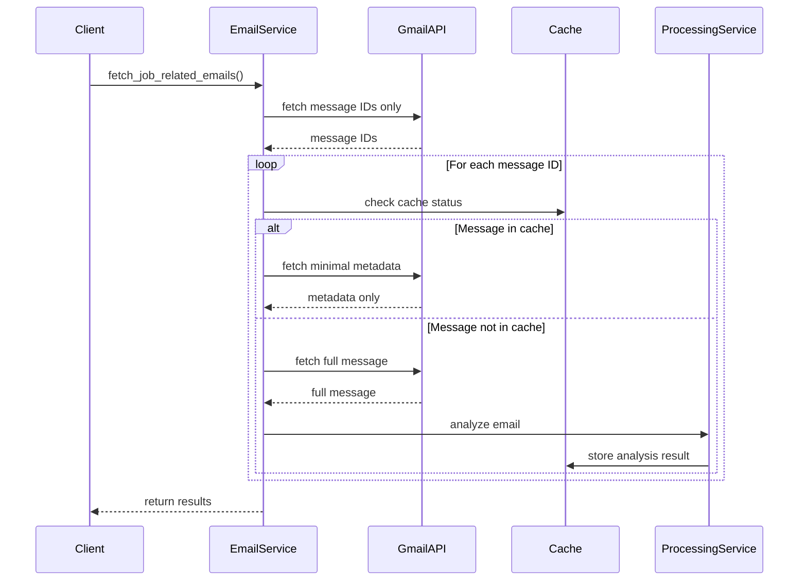

Building a secure and efficient email analysis system requires careful consideration of authentication, data processing, and performance optimization. This article explores the implementation of an email analysis feature using Google OAuth for authentication and GPT4O MINI for content analysis, with a focus on system architecture and best practices.

# Email Analysis with Google OAuth Integration

## Overview
This document outlines the implementation of the email analysis feature using Google OAuth for authentication and GPT4O MINI for email content analysis. The system allows users to analyze their job-related emails by connecting their Gmail account, processing the emails, and presenting the results in a structured format.


## Architecture



### Key Components

1. **Frontend Layer**
   - EmailAnalysis Page: React-based UI for email analysis
   - Google OAuth Integration: Handles user authentication flow
   - Local Storage: Stores JWT session token
   - Material-UI Components: Modern and responsive design

2. **Backend Services**
   - **Token Service**
     - Manages Gmail OAuth tokens
     - Generates and validates JWT session tokens
     - Handles token refresh and expiration
     - Implements token caching strategy

   - **Email Service**
     - Fetches emails using Gmail API
     - Implements batched email retrieval
     - Handles rate limiting and quotas
     - Manages email metadata caching

   - **Processing Service**
     - Analyzes email content
     - Classifies job application status
     - Extracts relevant information
     - Implements result caching

3. **Caching Layer**
   - **Token Cache**
     - TTLCache for Gmail access tokens (1 hour TTL)
     - MongoDB for refresh tokens (persistent)
   
   - **Analysis Cache**
     - Memory Cache: Fast access to recent results (7 days TTL)
     - MongoDB Cache: Long-term storage (360 days TTL)

4. **Security Layer**
   - JWT-based session management
   - Secure token storage and transmission
   - Rate limiting and request validation
   - Error handling and logging

## Components

### Frontend Components
1. **EmailAnalysis Page**
   - Path: `src/pages/EmailAnalysis/`
   - Handles user interaction and displays email analysis results
   - Manages Google OAuth flow initiation

2. **Header Integration**
   - Path: `src/components/Layout/Header.tsx`
   - Provides navigation access to email analysis feature
   - Uses `MailOutlined` icon for visual representation

### Backend Services

1. **Token Service** (`server-python/src/services/token_service.py`)
   - Manages OAuth token lifecycle
   - Handles token exchange and validation
   - Implements token caching for performance

2. **Email Service** (`server-python/src/services/email_service.py`)
   ```mermaid
   sequenceDiagram
       participant Client
       participant EmailService
       participant TokenService
       participant GmailAPI
       participant ProcessingService
       
       Client->>EmailService: fetch_job_related_emails()
       EmailService->>TokenService: get_valid_token()
       TokenService->>TokenService: validate & refresh if needed
       TokenService-->>EmailService: Gmail access token
       EmailService->>GmailAPI: fetch with access token
       GmailAPI-->>EmailService: raw emails
       EmailService->>ProcessingService: process emails
       ProcessingService-->>EmailService: analysis results
       EmailService-->>Client: structured results
   ```

3. **Email Processing Service** (`server-python/src/services/email_processing_service.py`)
   - Analyzes email content using AI models
   - Classifies job application status
   - Extracts relevant information (company, position, dates)
   - Implements caching for processed results
   - Uses TTLCache for performance optimization

### API Routes

1. **OAuth Routes** (`server-python/src/routes/email_routes.py`)
   - POST `/auth/google`: Handle OAuth callback and create session token
   - GET `/auth/validate`: Validate JWT session token
   - GET `/emails/fetch`: Fetch and analyze emails (requires valid JWT)

## Data Models

### Token Models


### Email Analysis Models


## OAuth Authentication and Token Management

### OAuth Flow and Token Relationships


### Token Types and Exchange Process


### Token Types and Purposes

1. **Authorization Code**
   - Temporary, one-time code
   - Generated by Google OAuth consent screen
   - Used to obtain other tokens
   - Short-lived (minutes)
   - Can only be used once

2. **JWT Session Token**
   - Generated by our backend
   - Used for user authentication
   - Contains user information (email, name, etc.)
   - Signed by our backend
   - Example:
     ```json
     {
       "sub": "user@example.com",
       "name": "User Name",
       "picture": "https://example.com/photo.jpg",
       "exp": 1516242622
     }
     ```

3. **Gmail Access Token**
   - Bearer token format
   - Used for Gmail API access
   - Short-lived (1 hour)
   - Stored in backend cache
   - Never exposed to frontend

4. **Gmail Refresh Token**
   - Long-lived token
   - Used to obtain new Gmail Access Tokens
   - Stored securely in backend database
   - Never exposed to frontend

### Token Storage and Security

1. **Storage Implementation**
   - Frontend Storage:
     - Store only JWT Session Token (localStorage)
     - Used for authentication with our backend
   
   - Backend Storage:
     - MongoDB (persistent storage):
       ```python
       {
           "email": "user@example.com",
           "refresh_token": "1//04u...",      # Gmail Refresh Token
           "redirect_uri": "https://example.com",
           "updated_at": "2024-02-12T00:00:00Z"
       }
       ```
     - Memory Cache (temporary storage):
       ```python
       {
           "user@example.com": {
               "access_token": "ya29.a0AfB_...",  # Gmail Access Token
               "expires_at": "2024-03-10T10:00:00Z"
           }
       }
       ```

2. **Token Refresh Process**
   ```mermaid
   sequenceDiagram
       Frontend->>Backend: Request with JWT Token
       Backend->>Backend: Validate JWT Token
       Backend->>Cache: Check Gmail Access Token
       alt Token Expired
           Backend->>MongoDB: Get Gmail Refresh Token
           Backend->>Google: Request New Access Token
           Google->>Backend: Return New Access Token
           Backend->>Cache: Update Access Token
       end
       Backend->>Frontend: Return Response
   ```

3. **Security Considerations**
   - Authorization Code: Temporary, HTTPS transmission
   - Gmail Access Token: Short-lived, backend-only
   - Gmail Refresh Token: Encrypted storage, backend-only
   - JWT Session Token: Frontend storage, signed by backend

### Token Management Functions
```python
# Token Store Operations
async def get_user_tokens(user_email: str) -> TokenInfo
async def update_user_tokens(user_email: str, token_data: TokenInfo)
async def delete_user_tokens(user_email: str)

# Token Service Operations
async def exchange_id_token(id_token: str) -> TokenInfo
async def refresh_access_token(refresh_token: str) -> TokenInfo
```

## Configuration

### Environment Variables
Required environment variables for setup:
- `GMAIL_CLIENT_ID`: Google OAuth client ID
- `GMAIL_CLIENT_SECRET`: Google OAuth client secret
- `GMAIL_REDIRECT_URIS`: OAuth callback URL

### OAuth Scopes
The application requires the following Gmail API scopes:
- `https://www.googleapis.com/auth/gmail.readonly`
- `https://www.googleapis.com/auth/userinfo.email`

## Internationalization

The feature supports multiple languages including:
- English (en)
- Chinese (zh)
- Traditional Chinese (zh-tw)
- Japanese (ja)
- Spanish (es)
- Korean (ko)

## Security Considerations

1. **Token Storage**
   - Tokens are stored securely in MongoDB
   - In-memory cache used for performance optimization
   - Automatic token refresh handling

2. **Authentication Flow**
   - Implements standard OAuth 2.0 flow
   - Uses secure token exchange
   - Implements token expiration handling

## Error Handling

The system implements comprehensive error handling for:
- OAuth authentication failures
- Email fetching errors
- Processing service errors
- Rate limiting and throttling

## Performance Optimization

1. **Caching Strategy**
   - Two-tier caching system for email analysis results:
     - TTLCache (in-memory): Fast access, 7 days TTL
     - MongoDB (persistent): Long-term storage, 360 days TTL
   - Optimized email fetching process:
     - First fetch only message IDs
     - Check cache status for each message ID
     - For cached messages:
       - Only fetch minimal metadata (subject, from, to, date)
       - Skip body content fetching and parsing
     - For uncached messages:
       - Fetch full message content
       - Perform analysis
       - Cache results
   - Token caching for reduced API calls
   - Batch processing for multiple emails

2. **Rate Limiting**
   - Implements Gmail API rate limit handling
   - Batch processing to optimize API usage
   - Minimizes API calls through efficient caching

### Cache Settings
```python
# Memory Cache (TTLCache)
MAX_TOKEN_CACHE_SIZE = 1000      # Maximum tokens to cache
TOKEN_CACHE_TTL = 3600          # 1 hour in seconds

MAX_ANALYSIS_CACHE_SIZE = 1000   # Maximum analysis results to cache
ANALYSIS_CACHE_TTL = 604800     # 7 days in seconds

# MongoDB Cache
db_cache_ttl_days: int = 360    # 360 days for analysis results
```

### Email Fetching Process
