# MOCKI – AI-Powered Mock Interview Platform

**Tech Stack**: React + FastAPI + MongoDB + OpenAI + Qdrant + Redis + Celery + WebRTC + Firebase Auth + Resend

## System Architecture

```mermaid
graph TD
    User[User] --> Frontend[Frontend React]
    Frontend --> WebRTC[WebRTC Audio/Video]
    Frontend --> Websocket[Websocket Real-time Communication]
    Frontend <--> FirebaseAuth[Firebase Auth Authentication]

    Websocket <--> NodeBackend[NestJS Backend]
    NodeBackend <--> RedisPS[Redis Pub/Sub]
    NodeBackend <--> PythonBackend[Python Backend]

    NodeBackend --> STT[Speech to Text STT]
    NodeBackend --> TTS[Text to Speech TTS]
    NodeBackend --> TranslationAPI[Translation API]

    PythonBackend --> OpenAI[OpenAI API]
    PythonBackend --> Qdrant[Qdrant Vector Database]
    PythonBackend --> MongoDB[MongoDB]
    PythonBackend --> Redis[Redis Cache]
    PythonBackend --> CeleryWorkers[Celery Workers]

    CeleryWorkers --> Flower[Flower Monitoring]
    Flower --> Prometheus[Prometheus]
    Prometheus --> Grafana[Grafana Visualization]

    PythonBackend --> Gmail[Gmail API]
    PythonBackend --> Resend[Resend Email Service]

    subgraph Security System
    RateLimiter[Redis Rate Limiter]
    BloomFilter[Bloom Filter]
    Vault[HashiCorp Vault]
    end

    PythonBackend --> Security System
```

## 🌟 Core Features & System Modules

### 1. AI-Powered Mock Interview Platform (Core Product Capability)

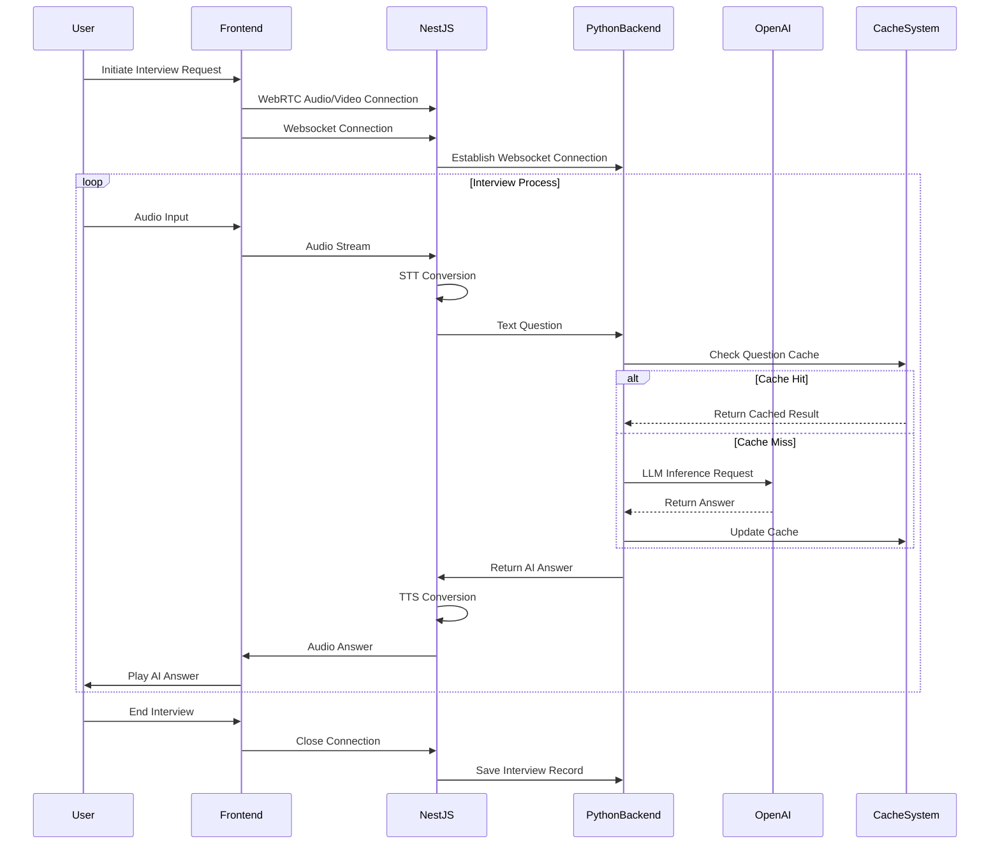

- Independently developed complete pipeline: audio-video interview process based on WebRTC → STT → LLM inference → TTS audio return, supporting seamless switching between AI and human interviewers
- Built real-time communication system based on Socket.IO + Redis Pub/Sub + Redis Adapter, supporting message synchronization and state broadcasting in multi-client, multi-instance deployments
- Supports role switching (system, AI, human), question bank management, resume import, and position-specific Q&A, building structured and unstructured question combinations
- System Architecture:
  - NestJS Backend: Handles audio-video calls and conversation records, HTTP calls to translation and TTS APIs, streaming STT (Baidu, Google, iFlytek), maintains WebSocket connections with frontend and Python backend
  - Python Backend: Handles AI requests, RAG system, email analysis system, user login management, rate limiting. Connects with NodeJS via WebSocket in AI interview system, and interacts with frontend via REST API for login and email analysis

### 2. Intelligent Email Analysis System (AI Information Extraction + Auto-closing)

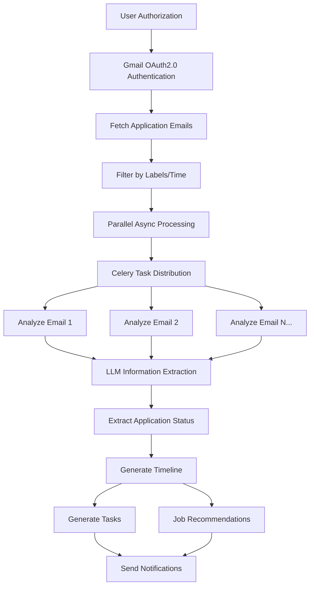

- Supports user login via Gmail OAuth2.0, uses Gmail API to fetch application emails, filters historical emails by labels/time
- Uses parallel async LLM to analyze email content, extracts application status (read, replied, interview invitation), position name, company info, and aggregates into Timeline
- Integrates company position information to push job recommendations to users

### 3. Todo Management & Smart Reminder System

- Automatically generates todos based on email analysis and user behavior, "TODO" "DONE", building complete application tracking path
- Uses Resend to implement time-triggered deadline reminders, real-time notifications, and status change pushes, avoiding key information omissions
- Supports status synchronization and cross-device access, user operations instantly feedback to database

### 4. RAG System & Contextual Q&A Optimization

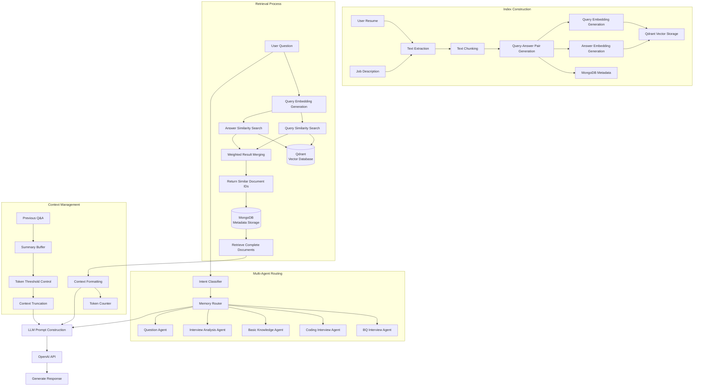

- Vector search engine based on LangChain + Qdrant, supporting Query-Answer vector similarity search
- Efficient retrieval process: user questions are vectorized and simultaneously compared with pre-processed Query and Answer vectors for similarity calculation, with weighted merging of results to obtain the most relevant content
- Optimized document processing: interview materials are pre-processed into Query-Answer pairs, with separate embedding calculations, enabling retrieval to consider both question similarity and answer relevance
- Simplified index structure: direct vector similarity sorting for retrieval, avoiding complex index algorithm tuning while meeting performance requirements at current data scale
- Multi-turn Q&A using ConversationSummaryBufferMemory for summary caching, combined with Token threshold controller for automatic context truncation, reducing overall Token cost by 45%
- Intent classification using LangChain LLMChain, driving MemoryRouter for dynamic context switching between multiple Agents
- Professional Agent system includes:
  - BQ Interview Agent: handling behavioral questions and soft skills assessment
  - Coding Interview Agent: evaluating programming ability and algorithm analysis
  - Basic Knowledge Agent: testing professional domain knowledge
  - Interview Analysis Agent: providing interview performance evaluation and feedback
  - Question Agent: generating in-depth questions based on candidate background

### 5. Asynchronous Task System (Performance Guarantee)

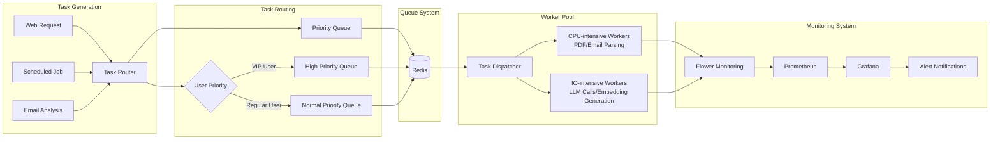

- Multi-machine multi-queue task scheduling system based on Celery + Redis, with Worker pool independently deployed for CPU-intensive (PDF/email parsing) and IO-intensive (LLM calls, embedding generation) tasks
- Priority task scheduling (e.g., VIP user request queue jumping), reducing urgent task average latency by 60%
- Real-time monitoring with Flower, combined with Prometheus/Grafana for automatic alerts and visual tracking of task failure rates and queue backlog metrics

#### Flower Monitoring Tool Details

Flower is Celery's officially recommended task monitoring tool, suitable for **real-time monitoring of Celery task execution, Worker status, task queue backlog, etc.**. It can be understood as Celery's visual Dashboard + API server.

**Flower Features:**

- 👨‍🔧 Worker status (active, stopped, heartbeat lost)
- 📦 Queue length (backlog status)
- ✅ Task execution status (success, failure, retry, duration)
- 🧩 Task details (input parameters, return results, exception stack)
- 📈 Real-time task throughput, failure rate charts

**Start Flower:**

```bash
celery -A your_app flower --port=5555
```

**Alert Implementation with Prometheus + Grafana:**

1. Use `celery-exporter` to expose Celery data as Prometheus metrics
2. Configure Prometheus rules (e.g., task failures > threshold)
3. Set trigger conditions in Grafana (e.g., failure rate > 10% within 5 minutes) for alerts (email/Slack/Feishu/Webhook)

### 6. Multi-dimensional Rate Limiting & Security Protection

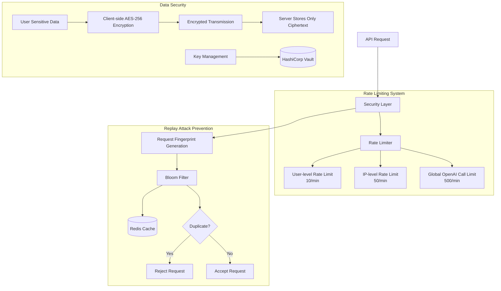

- User-level (10/min), IP-level (50/min), and global OpenAI call-level (500/min) rate limiting system built with Redis sliding window algorithm, intercepting 98% of high-frequency abuse requests
- Combined with Redis Bloom filter to cache processed request fingerprints, preventing duplicate submissions or replay attacks, with false positive rate < 0.1%

### 7. Multi-level Cache & High-frequency Interface Performance Optimization

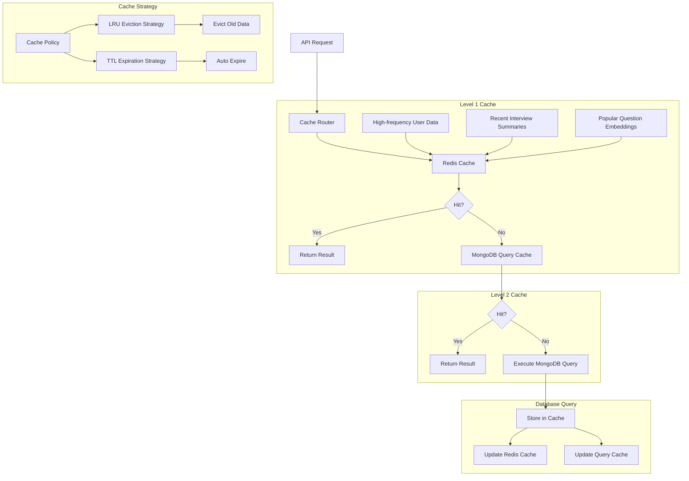

- High-frequency data (e.g., user's last 3 interview summaries) using Redis cache with JSON serialization storage, reducing query latency from MongoDB's 15ms to 1ms
- Pre-generated and cached high-frequency interview question embeddings, reducing OpenAI API call volume by 35%
- Lightweight MongoDB query cache layer with LRU + TTL strategy for automatic old data eviction, reducing high-frequency query (e.g., user/position information) latency from 15ms to 1ms, increasing overall QPS by 4x

### 8. User Authentication & Data Security

- 前端集成 Firebase Auth 实现身份认证，后端结合 JWT 管理权限与登录态
- 敏感数据（如用户简历）使用客户端 AES-256 加密传输，服务端仅存储密文，密钥托管在 HashiCorp Vault

## Performance Metrics & Optimization Results

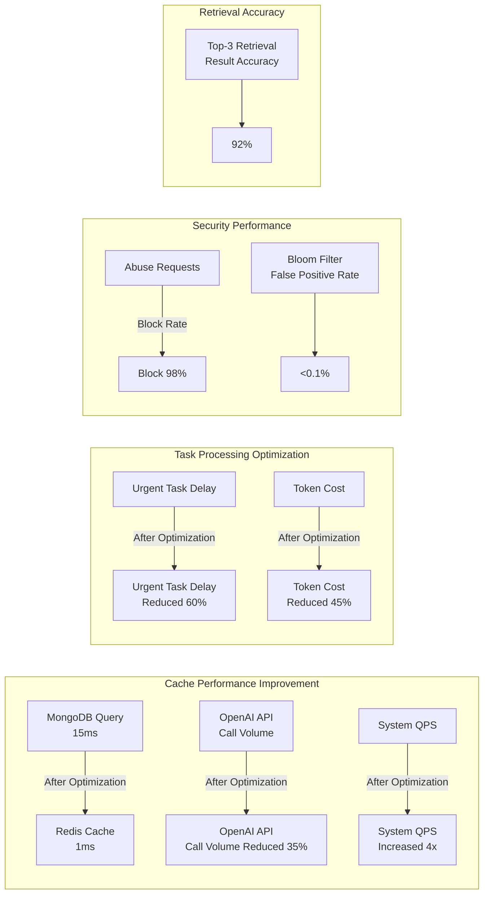

## Technical Highlights

1. **Real-time Audio-Video System**

   - Low-latency interview system built with WebRTC + Socket.IO + Redis Pub/Sub, supporting seamless switching between AI and human interviewers

2. **High-performance RAG Architecture**

   - Vector search engine based on LangChain + Qdrant, supporting Query-Answer vector similarity search

3. **Multi-level Cache Design**

   - Multi-level architecture with Redis + MongoDB query cache, reducing key query latency from 15ms to 1ms, increasing system QPS by 4x

4. **Asynchronous Task Optimization**

   - CPU/IO separation deployment strategy based on Celery, with priority scheduling, reducing urgent task latency by 60%

5. **Efficient Token Management**

   - Reducing overall token cost by 45% through summary caching and context truncation

6. **Comprehensive Security Protection**

   - Multi-dimensional rate limiting + Bloom filter + end-to-end encryption, blocking 98% of abuse requests with &lt;0.1% false positive rate

7. **Multi-Agent Routing System**

   - Context-aware dynamic routing based on intent classification, supporting switching between specialized domain agents

8. **Intelligent Email Analysis**
   - Gmail API integration + parallel async LLM processing + semantic extraction, building an intelligent tracking system for the entire application lifecycle

---

# MOCKI – AI 驱动的模拟面试平台

**技术栈**：React + FastAPI + MongoDB + OpenAI + Qdrant + Redis + Celery + WebRTC + Firebase Auth + Resend

## 系统架构

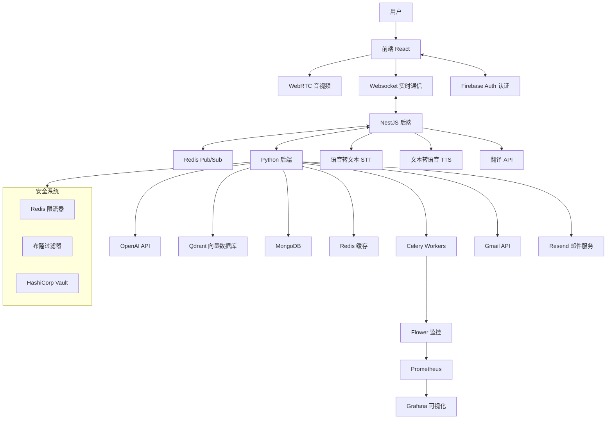

## 🌟 核心功能与系统模块

### 1. AI 驱动的模拟面试平台（核心产品能力）

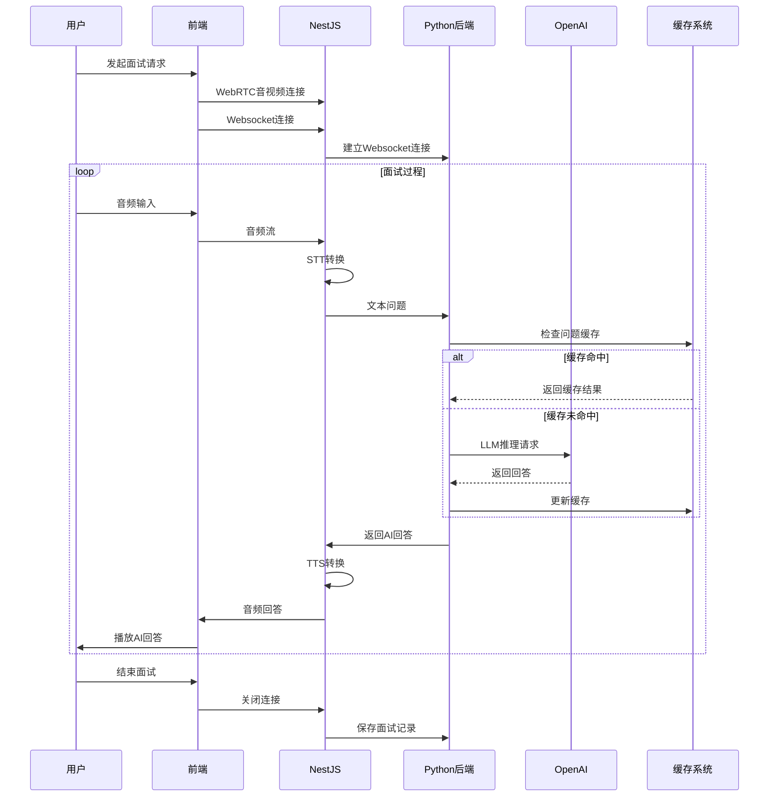

- 独立开发完整链路：音视频面试流程基于 WebRTC → STT → LLM 推理 → TTS 返回音频，支持 AI 面试官与真人面试官自由切换
- 构建基于 Socket.IO + Redis Pub/Sub + Redis Adapter 的实时通信系统，支持多客户端、多实例部署下的消息同步与状态广播
- 支持角色切换（系统、AI、真人）、问题库管理、简历导入与职位定向问答，构建结构化与非结构化问题组合
- 系统架构：
  - NestJS后端：负责连接音视频通话和对话记录，HTTP调用翻译API和TTS API，流式STT（百度、谷歌、讯飞），维持与前端的websocket连接，同时与Python后端保持websocket连接
  - Python后端：处理AI请求，RAG系统，邮件分析系统，管理用户登录，实现限流。在AI面试系统中与nodejs通过websocket连接，在登录、邮件分析系统与前端通过REST API交互

### 2. 邮件智能分析系统（AI 信息抽取 + 自动闭环）

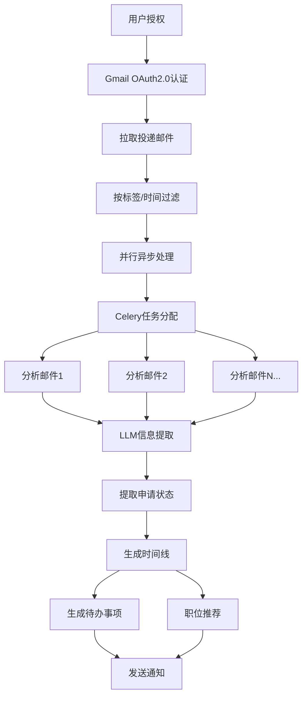

- 支持用户通过 OAuth2.0 登录 Gmail，使用 Gmail API 拉取投递邮件，按标签/时间过滤历史邮件
- 使用并行异步 LLM 分析邮件内容，提取申请状态（如已读、已回复、面试邀请）、职位名称、公司信息等字段，并聚合形成 Timeline
- 整合公司职位信息，向用户推送职位列表推荐

### 3. 待办事项管理与智能提醒系统

- 自动根据邮件解析与用户行为生成待办事项，"TODO" "DONE"等，构建完整投递跟踪路径
- 使用 Resend 实现基于时间触发的临期提醒、实时通知与状态变更推送，避免关键信息遗漏
- 支持状态同步与跨设备访问，用户操作即时反馈至数据库

### 4. RAG 系统与上下文问答能力优化

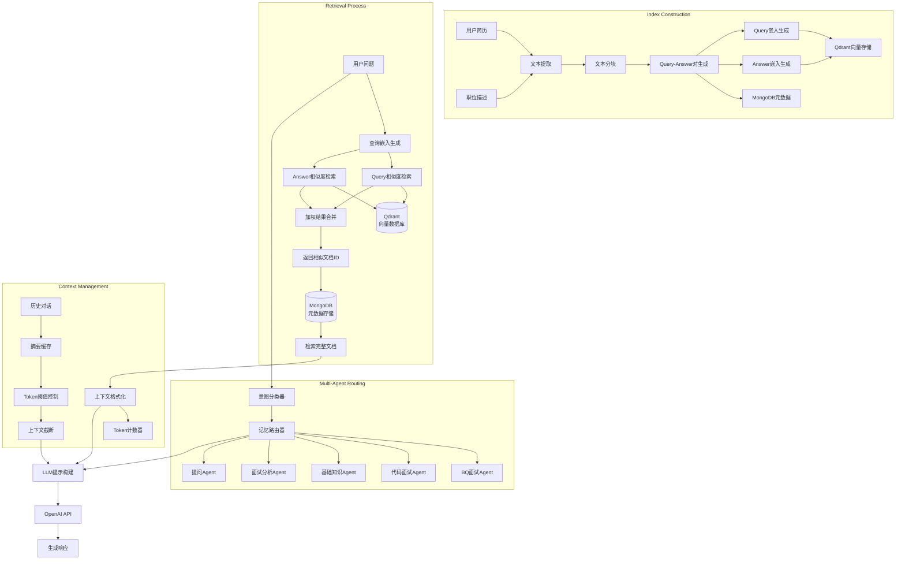

- Vector search engine based on LangChain + Qdrant, supporting Query-Answer vector similarity search
- Efficient retrieval process: user questions are vectorized and simultaneously compared with pre-processed Query and Answer vectors for similarity calculation, with weighted merging of results to obtain the most relevant content
- Optimized document processing: interview materials are pre-processed into Query-Answer pairs, with separate embedding calculations, enabling retrieval to consider both question similarity and answer relevance
- Simplified index structure: direct vector similarity sorting for retrieval, avoiding complex index algorithm tuning while meeting performance requirements at current data scale
- Multi-turn Q&A using ConversationSummaryBufferMemory for summary caching, combined with Token threshold controller for automatic context truncation, reducing overall Token cost by 45%
- Intent classification using LangChain LLMChain, driving MemoryRouter for dynamic context switching between multiple Agents
- Professional Agent system includes:
  - BQ Interview Agent: handling behavioral questions and soft skills assessment
  - Coding Interview Agent: evaluating programming ability and algorithm analysis
  - Basic Knowledge Agent: testing professional domain knowledge
  - Interview Analysis Agent: providing interview performance evaluation and feedback
  - Question Agent: generating in-depth questions based on candidate background

### 5. 异步任务系统（性能保障能力）


- Multi-machine multi-queue task scheduling system based on Celery + Redis, with Worker pool independently deployed for CPU-intensive (PDF/email parsing) and IO-intensive (LLM calls, embedding generation) tasks
- Priority task scheduling (e.g., VIP user request queue jumping), reducing urgent task average latency by 60%
- Real-time monitoring with Flower, combined with Prometheus/Grafana for automatic alerts and visual tracking of task failure rates and queue backlog metrics

#### Flower Monitoring Tool Details

Flower is Celery's officially recommended task monitoring tool, suitable for **real-time monitoring of Celery task execution, Worker status, task queue backlog, etc.**. It can be understood as Celery's visual Dashboard + API server.

**Flower Features:**

- 👨‍🔧 Worker status (active, stopped, heartbeat lost)
- 📦 Queue length (backlog status)
- ✅ Task execution status (success, failure, retry, duration)
- 🧩 Task details (input parameters, return results, exception stack)
- 📈 Real-time task throughput, failure rate charts

**Start Flower:**

```bash
celery -A your_app flower --port=5555
```

**Alert Implementation with Prometheus + Grafana:**

1. Use `celery-exporter` to expose Celery data as Prometheus metrics
2. Configure Prometheus rules (e.g., task failures > threshold)
3. Set trigger conditions in Grafana (e.g., failure rate > 10% within 5 minutes) for alerts (email/Slack/Feishu/Webhook)

### 6. 多维限流与安全防护机制


- User-level (10/min), IP-level (50/min), and global OpenAI call-level (500/min) rate limiting system built with Redis sliding window algorithm, intercepting 98% of high-frequency abuse requests
- Combined with Redis Bloom filter to cache processed request fingerprints, preventing duplicate submissions or replay attacks, with false positive rate < 0.1%

### 7. 多级缓存与高频接口性能优化


- High-frequency data (e.g., user's last 3 interview summaries) using Redis cache with JSON serialization storage, reducing query latency from MongoDB's 15ms to 1ms
- Pre-generated and cached high-frequency interview question embeddings, reducing OpenAI API call volume by 35%
- Lightweight MongoDB query cache layer with LRU + TTL strategy for automatic old data eviction, reducing high-frequency query (e.g., user/position information) latency from 15ms to 1ms, increasing overall QPS by 4x

### 8. 用户认证与数据安全

- 前端集成 Firebase Auth 实现身份认证，后端结合 JWT 管理权限与登录态
- 敏感数据（如用户简历）使用客户端 AES-256 加密传输，服务端仅存储密文，密钥托管在 HashiCorp Vault

## 性能指标与优化效果


## 技术亮点总结

1. **实时音视频交互系统**

   - WebRTC + Socket.IO + Redis Pub/Sub 构建的低延迟面试系统，支持AI与真人无缝切换

2. **高性能RAG架构**

   - Vector search engine based on LangChain + Qdrant, supporting Query-Answer vector similarity search

3. **多级缓存设计**

   - Redis + MongoDB查询缓存的多级架构，将关键查询延迟从15ms降至1ms，系统QPS提升4倍

4. **异步任务优化**

   - 基于Celery的CPU/IO分离部署策略，结合优先级调度，紧急任务延迟降低60%

5. **高效Token管理**

   - 通过摘要缓存与上下文截断技术，整体Token成本降低45%

6. **全面的安全防护**

   - 多维限流 + 布隆过滤器 + 端到端加密，拦截98%滥用请求，误判率&lt;0.1%

7. **多Agent路由系统**

   - 基于意图分类的上下文动态路由，支持在不同专业领域Agent间切换

8. **邮件智能分析**
   - Gmail API集成 + 并行异步LLM处理 + 语义提取，构建投递全生命周期的智能跟踪系统
